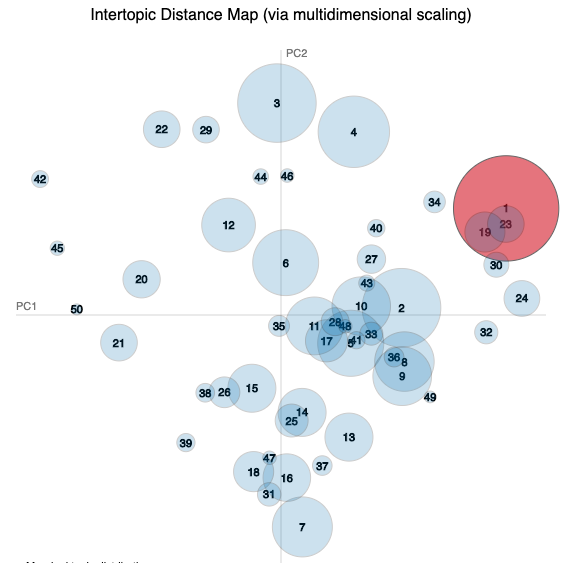
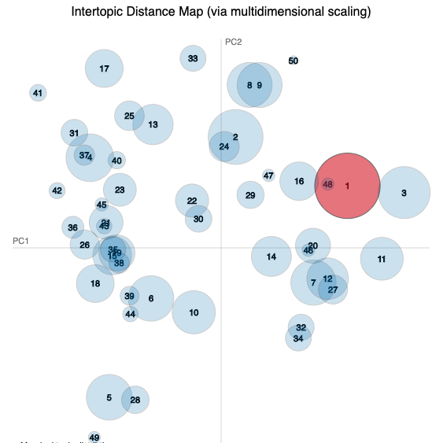
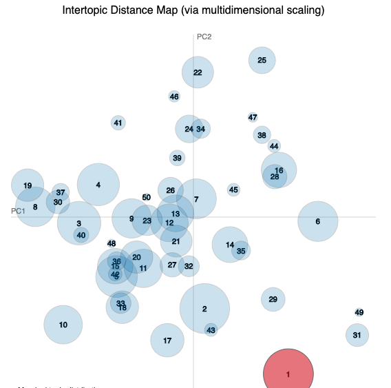
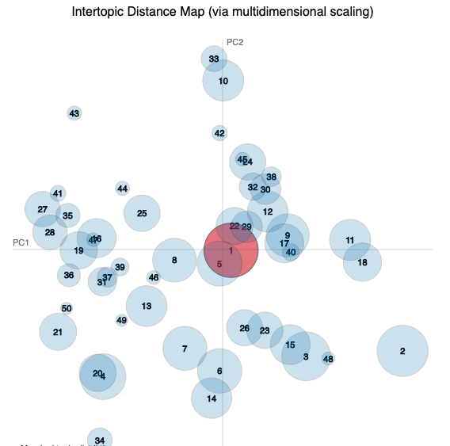
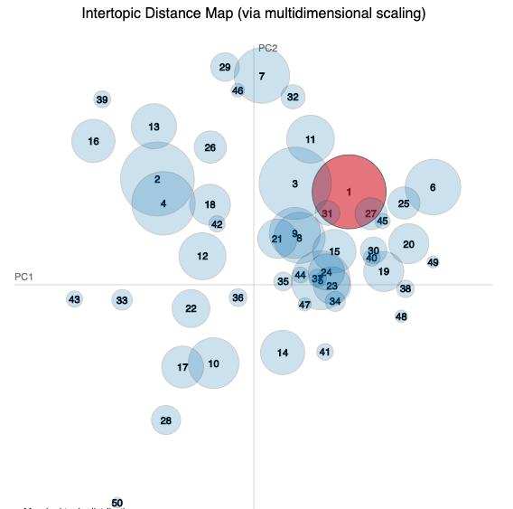
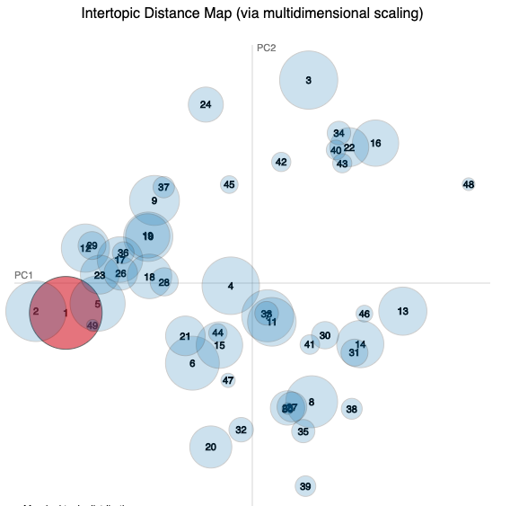

# TEFCluster
Explore the Teaching Excellence Framework (TEF) submissions using clustering and related techniques. Work by Phil Reed for PGCert assignment 2019-20. 

- See the [🇬🇧whole visualisation](result/LDA_plot.html)
- See breakdown by award:
  [🥇gold visualisation](result/LDA_plot_gold.html), 
  [🥈silver visualisation](result/LDA_plot_silver.html) and 
  [🥉bronze visualisation](result/LDA_plot_bronze.html)
- See breakdown by level: [🏨HEI visualisation](result/LDA_plot_hei.html) and
  [🏫FEC visualisation](result/LDA_plot_fec.html)
- _work in progress_

An exploration of further analysis that could be used for TEF, following 
[Evidencing teaching excellence](https://s3.eu-west-2.amazonaws.com/assets.creode.advancehe-document-manager/documents/hea/private/hub/download/TEF2%20Provider%20Submissions%20Review_2_1568037563.pdf): 
Analysis of the TEF2 provider submissions, by Joanne Moore, Louise Higham and 
John Sanders (ARC Network), in partnership with Steven Jones, Duygy Candarli 
(University of Manchester) and Anna Mountford-Zimdars (University of Exeter).

Uses [TEF data from Office for Students](https://www.officeforstudents.org.uk/advice-and-guidance/teaching/tef-data/get-the-data/). 

## Method

Use LDA clustering technique as in <a href="https://www.research.manchester.ac.uk/portal/en/publications/corporate-social-responsibility-reports(111f0746-0250-4206-a4a9-300b5e39df59).html">previous work</a>.

Perform the text2vec process after cleaning the data, then 
create a visualisation of the topics that are automatically identified.

## Analysis

### Most salient terms
These terms are most important within the identified topics.

|Rank|	🇬🇧Whole |🥇Gold	|🥈Silver|🥉Bronze|🏨HEI | 🏫LEC |
|---:|--------|-------|-------|------|----|-----|
|1	|student	|student|	student|	student|univers|colleg |
|2|	univers|	univers|	univers	|colleg|student|student |
|3	|colleg	|teach	|colleg|	univers|teach |learn |
|4	|learn	|colleg	|learn|	teach|learn|educ |
|5	|support	|learn	|teach	|progamm|employ |support |

### Most frequent terms

These terms are most frequent, regardless of topics.

|Rank|	🇬🇧Whole |🥇Gold	|🥈Silver|🥉Bronze|🏨HEI | 🏫LEC |
|---:|--------|-------|-------|------|----|-----|
|1	|student	|student	|student	|student| student|  student|
|2	|univers	|univers	|learn	|learn|univers| colleg|
|3	|learn	|support	|univers	|colleg|learn | support|
|4	|support	|teach	|develop	|support|support | learn|
|5	|teach	|learn	|teach	|develop| teach | develop|

### Major topics
These are the five 'largest' topics for each study. 
They are excerpts from the `*_word_vectors_for_each_topic.csv` files.

#### 🇬🇧Whole

|Topic 1 | Topic 2 | Topic 3 | Topic 4 | Topic 5 |
|--------|---------|---------|---------|---------|
|support |teach    |work     |learn    |univers|
|student |learn    |research |employ   |student|
|learn   |student  |graduat  |support  |teach|
|develop |success  |learn    |teach    |undergradu|
|includ  |experi   |employ   |skill    |studi|

#### 🥇Gold

|Topic 1 | Topic 2 | Topic 3 | Topic 4 | Topic 5 |
|--------|---------|---------|---------|---------|
|student |univers  |student  |practic  |well |
|support |teach    |academ   |staff    |first |
|improv  |student  |support  |learn    |year |
|research|learn    |also     |feedback |provid |
|inform  |studi    |use      |includ   |three |

#### 🥈Silver

|Topic 1 | Topic 2 | Topic 3 | Topic 4 | Topic 5 |
|--------|---------|---------|---------|---------|
|develop |learn    |student  |student  |colleg   |
|learn   |develop  |provid   |metric   |student |
|teach   |programm |programm |tef      |part    |
|profession|student|feedback |employ   |progress|
|staff   |support  |learn    |data     |work    |

#### 🥉Bronze

|Topic 1 | Topic 2 | Topic 3 | Topic 4 | Topic 5 |
|--------|---------|---------|---------|---------|
|employ  |student  |student  |colleg   |learn|
|work    |learn    |staff    |higher   |ukprn|
|skill   |develop  |develop  |provis   |can|
|feedback|project  |support  |develop  |name|
|use     |support  |higher   |learn    |event|

#### 🏨HEI

|Topic 1 | Topic 2 | Topic 3 | Topic 4 | Topic 5 |
|--------|---------|---------|---------|---------|
|student |learn    |univers  |develop  |support |
|feedback|develop  |student  |learn    |employ |
|academ  |work     |employ   |research |teach |
|offer   |experi   |studi    |staff    |sector |
|work    |profession|enhanc  |institut |improv | 
|librari |staff    |engag    |provid   |work |

#### 🏫FEC

|Topic 1 | Topic 2 | Topic 3 | Topic 4 | Topic 5 |
|--------|---------|---------|---------|---------|
|student |student  |colleg   |employ   |student|
|support |develop  |educ     |higher   |within|
|skill   |learn    |learn    |progress |engag|
|use     |support  |work     |programm |academ|
|cours   |skill    |provis   |student  |develop|

_to do_

## Directory structure
`data/`

- `raw/` (excluded from version control)
    - `tef_y2_allcontext.csv` 
    - `tef_y2_allmetrics.csv`
    - `tefyeartwo_awards.xlsx`
    - `TEFYearTwo_AllSubmissions/` folder
        - 232 files with names such as:
        - `10000055_Abingdon and Witney College_Submission.pdf`
        - `PROVIDER_TEFUKPRN` underscore `PROVIDER_NAME` underscore `.pdf`
    - `TEFYearTwo_AllSubmissions_txt/` folder
        - We convert all the PDF documents to TXT files.
    - (`TEFYearTwo_AllSubmissions_txt_pl2sin/` folder) _to do_
        - (We replace all plural words with the singular forms.) _to do_
- `processed/`
    - `tdm.rds` text document matrix data
    - `gold_tdm.rds`
    - `silver_tdm.rds`
    - `bronze_tdm.rds`
    - `hei_tdm.rds`
    - `fec_tdm.rds`

`code/` 

- `convert_pdf2txt.R` Convert directory in one go from PDF to txt
- `text2vec_whole.R` Perform LDA (column for award) and create visualization
- `text2vec_gold.R` Just gold awarded institutions (run after 'whole')
- `text2vec_silver.R` Just silver awarded institutions (run after 'whole')
- `text2vec_bronze.R` Just bronze awarded institutions (run after 'whole')
- `text2vec_hei.R` Just 'HigherEducationInstitution' (run after 'whole')
- `text2vec_fec.R` Just 'FurtherEducationCollege' (run after 'whole')

`result/`

- `LDA_plot.Rmd` The knitR file to launch the visualization
- [`LDA_plot.html`](result/LDA_plot.html) The knitted visualization
- `whole_doc_topic_probabilities.csv` Probability of each topic in each doc
- `whole_word_vectors_for_each_topic.csv` Which words occur in which topics
- `ldavis/` folder
   - The HTML, CSS and JavaScript files for the `LDA_plot.html` file
- `LDA_plot_gold.Rmd`
- [`LDA_plot_gold.html`](result/LDA_plot_gold.html) 
- `gold_doc_topic_probabilities.csv`
- `gold_word_vectors_for_each_topic.csv`
- `gold_ldavis/` folder
- `LDA_plot_silver.Rmd`
- [`LDA_plot_silver.html`](result/LDA_plot_silver.html) 
- `silver_doc_topic_probabilities.csv`
- `silver_word_vectors_for_each_topic.csv`
- `silver_ldavis/` folder
- `LDA_plot_bronze.Rmd`
- [`LDA_plot_bronze.html`](result/LDA_plot_bronze.html) 
- `bronze_doc_topic_probabilities.csv`
- `bronze_word_vectors_for_each_topic.csv`
- `bronze_ldavis/` folder
- `LDA_plot_hei.Rmd`
- [`LDA_plot_hei.html`](result/LDA_plot_hei.html) 
- `hei_doc_topic_probabilities.csv`
- `hei_word_vectors_for_each_topic.csv`
- `hei_ldavis/` folder
- `LDA_plot_fec.Rmd`
- [`LDA_plot_rec.html`](result/LDA_plot_fec.html) 
- `fec_doc_topic_probabilities.csv`
- `fec_word_vectors_for_each_topic.csv`
- `fec_ldavis/` folder
- `maps/` folder
   - `map1_whole.png` Intertopic distance map for whole
   - `map2_gold.png` Intertopic distance map for gold
   - `map3_silver.png` Intertopic distance map for silver
   - `map4_bronze.png` Intertopic distance map for bronze
   - `map5_hei.png` Intertopic distance map for HEI
   - `map6_fec.png` Intertopic distance map for FEC
   
   

## Next steps
- Further clean the data, manual work, maybe tokenize instead of stem.
- Identify what the major topics are and which ones used by which applicants.
